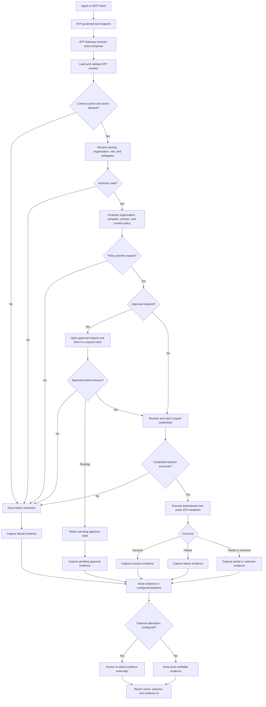

# How ATP Works

ATP sits between an agent and the tools it wants to use. The agent can still call tools through MCP or a framework adapter, but consequential actions pass through ATP before they touch the downstream system.

The short version:

```
Agent proposes action
  -> ATP loads the governing contract
  -> ATP checks identity, authority, and policy
  -> ATP requests approval when required
  -> ATP injects scoped credentials without exposing them to the agent
  -> ATP executes the action under mediation
  -> ATP records evidence and optional external attestation
  -> ATP returns the result plus governance metadata
```

## Runtime Process Flow



## Step-by-Step

| Step | What happens | ATP primitive | Failure behavior |
|------|--------------|---------------|------------------|
| 1. Action proposal | The agent calls a governed tool with an action name, input, principal context, and contract reference. | Action | Invalid requests are rejected before any downstream call. |
| 2. Contract load | ATP loads the execution contract and checks schema validity, expiry, revocation, allowed actions, and evidence requirements. | Contract | Missing, expired, revoked, or incompatible contracts deny execution. |
| 3. Authority check | ATP resolves who the agent is acting for, which organization boundary applies, and whether the agent's role can perform the action. | Authority | Unbound wallets, missing roles, or narrower delegated authority deny execution. |
| 4. Policy evaluation | ATP evaluates the most restrictive applicable policy across organization, template, contract, and runtime defaults. | Policy | Any policy violation denies execution. ATP is fail-closed. |
| 5. Approval gate | If the contract requires review, ATP opens an approval request and binds the approval to the exact request hash. | Approval | Rejection or timeout denies execution. Pending approval never executes early. |
| 6. Credential brokerage | ATP resolves the credential reference and injects a scoped credential into the mediated execution path. | Credential | If the credential cannot be resolved or injected, execution is denied. The agent never sees the raw secret. |
| 7. Managed execution | ATP invokes the downstream tool with timeout, idempotency, and outcome classification. | Execution | Failures, partial results, and unknown outcomes are first-class protocol outcomes. |
| 8. Evidence capture | ATP records the request hash, contract, policy result, approval state, credential path, execution outcome, timestamps, and hashes. | Evidence | Evidence write failures produce degraded or pending evidence states rather than silent success. |
| 9. Attestation | If configured, ATP anchors the evidence through an external attestation backend. | Attestation | ATP-Attested claims require verifiable anchoring; local evidence alone is not enough. |
| 10. Response | ATP returns the result, outcome, execution id, and evidence id to the agent or caller. | Result | The caller gets a governed result, not just a raw tool response. |

## Approval Branch

Approval is not a generic chat message or reusable human consent. ATP binds the approval to the exact action request:

```
request input -> canonical request hash -> approval request -> signed approval -> execution gate
```

If the request changes after approval, the hash changes and the approval no longer applies. This avoids the common failure mode where a human approves one thing and the agent executes a slightly different thing later.

## Credential Branch

The credential broker is the main security boundary:

```
Agent asks to execute action
  -> ATP checks that the action is allowed
  -> ATP resolves the credential reference server-side
  -> ATP injects the credential only into the mediated downstream call
  -> ATP removes or expires the credential after execution
```

The agent receives the result and evidence metadata. It does not receive the API key, OAuth token, service account credential, or vault secret.

## Evidence Branch

Every terminal path produces evidence:

| Path | Evidence produced |
|------|-------------------|
| Allowed and successful | Request, contract, policy result, approval if any, credential path, downstream result hash, success outcome. |
| Denied | Request, contract or policy reason, authority or policy failure, denial outcome. |
| Approval pending | Request, approval state, timeout and escalation metadata, pending outcome. |
| Failed execution | Request, policy pass, approval if any, credential path, failure reason, failure outcome. |
| Partial or unknown | Request, policy pass, approval if any, ambiguity marker, reconciliation requirement, partial or unknown outcome. |

This matters because ATP is not only an allow/deny wrapper. It is a governed execution record. The audit question is not just "did the tool run?" It is "was the action allowed, approved, executed under the right credential path, and provable afterward?"

## Where MCP Fits

MCP defines how an agent discovers and calls tools.

ATP defines whether a consequential tool call should happen, under what authority, with which approval, using which credential, and what evidence must exist afterward.

In practice, ATP can ship as MCP middleware:

```
Agent -> MCP tool call -> ATP governance -> downstream system -> evidence -> agent response
```

That means the agent experience stays familiar while the enterprise control point moves to the server-side endpoint.
